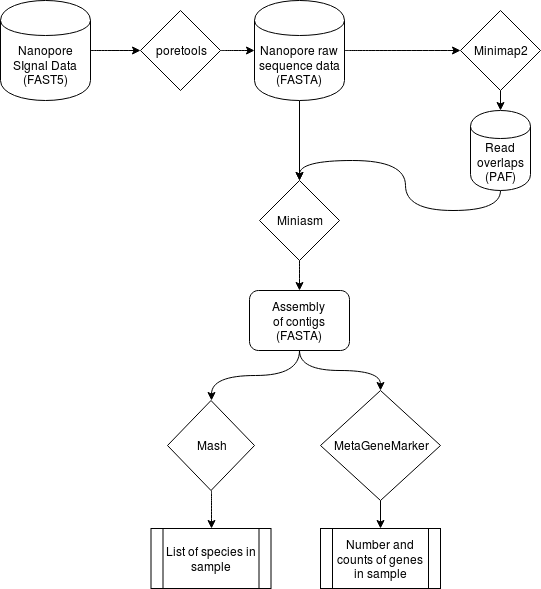

# SpoonFedNanopore
The world's simplest open-source nanopore alignment and assembly pipeline. This is meant to be an educational tool that Just Works(TM), and walks a user through assembling a metagenome from raw nanopore reads. This pipeline also performs gene annotation and gives the user taxanomic information through BLAST.

## Uses
* Educational tool for teaching undergrads or high school students the basics of genome assembly
* Simple tool for WIMP (What's In My Pot) analysis that doesn't require any external tools
* Citizen scientist that wants to sequence whatever's on their roommate's toothbrush

## Workflow

Reads are first classified based on genomic distance using 4mers using Mash. The reads are classified into bins which are then assembled into genomes using canu. The resulting assemblies are then blasted using TAXBLAST to see the taxanomic information from the sample. The pipeline also does simple gene annotation using MetaGeneMark.

## Disclaimer
Current workflow only implements the Canu assembly of raw reads and then the taxonomic information. Later steps will introduce the read clustering by Mash.
